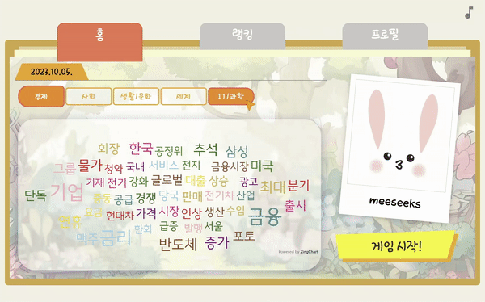
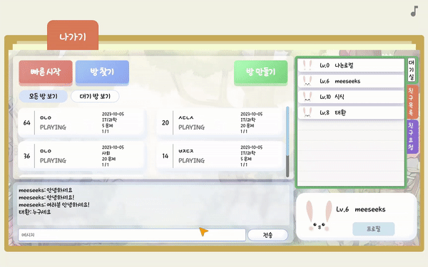

# 🐰식식프렌즈📆

프로젝트 설명

# 프로젝트 기간

2023.08.28 ~ 2023.10.06 (6주)

# 목차

- [🎯 기획배경](#subject)
- [⭐️ 주요 기능](#mainContents)
- [🖥️ 화면](#contents)
- [🛠️ 기술 스택](#skills)
- [💾 데이터 파이프라인](#dataPipelines)
- [⚙ 시스템 아키텍쳐](#systemArchitecture)
- [👷 설계](#design)
- [👥 팀원 소개](#members)

# 기획 배경

기획 배경

# 주요 기능

주요 기능

# 화면

### 1. 메인 페이지

게임의 특성을 살리기 위해 다양한 애니메이션 효과와 배경음악을 사용하여 밝고 신나는 분위기를 완성했습니다.

- 애니메이션 효과

- 배경음악 on/off 기능

- 로그인 및 회원가입 모달 애니메이션 효과

## 2. 워드 클라우드

## 3. 내 프로필

## 4. 게임

## 5. 대기실

# 기술 스택

## 프론트

---

## 백

---

## 데이터

# 데이터 파이프라인

사진 + 설명

# 시스템 아키텍쳐

## 메인 서버 (좌)

## 분산 클러스터링 서버 (우)

- AWS EC2 t2.xlarge 인스턴스

- Ubuntu 20.04

# 기획 및 설계 산출물

## 요구사항 정의

명세

## 화면 설계서

## ER Diagram

# 팀원 소개 및 역할 분담

| 이름      | **구희영**                                                                             | **권인식**                                                                                   | **김태환**                                                                                     | **이세울**                                                                                    | **김나연**                                                                                   | **황유성**                                                                                     |
|:-------:|:-----------------------------------------------------------------------------------:|:-----------------------------------------------------------------------------------------:|:-------------------------------------------------------------------------------------------:|:------------------------------------------------------------------------------------------:|:-----------------------------------------------------------------------------------------:|:-------------------------------------------------------------------------------------------:|
| **사진**  |  |  |  |  |  |  |
| **포지션** | 팀장 프론트엔드                                                                        | Server Game                                                                           | MSA Auth Member                                                                       | 프론트엔드                                                                                      | 데이터 파이프라인 설계 하둡 클러스터링  데이터 수집 및 저장                                               | 자연어처리  워드 클라우드 및 퀴즈 생성                                                            |
| **깃허브** | [Github](https://github.com/hi9900)                                                 | [Github](https://github.com/PassionSoftIan)                                               | [Github](https://github.com/kimta2hwan)                                                     | [Github](https://github.com/sl39)                                                          | [Github](https://github.com/nayeonxkim)                                                   | [Github](https://github.com/StarSein)                                                       |
