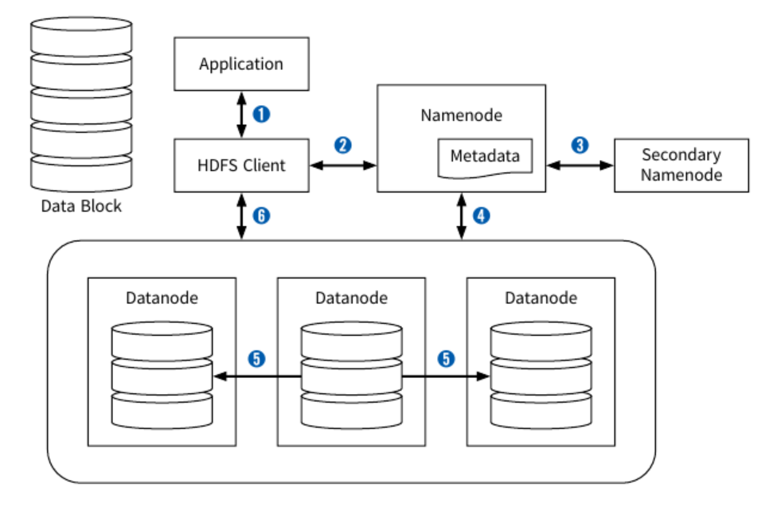

# TIL

## 하둡의 시스템 아키텍처
1. Hadoop File System: 분산 데이터 저장
2. Yarn: 분산 클러스터 리소스 관리
3. Apache Spark: 각종 데이터 처리 엔진

## HDFS

HDFS의 구조는 마스터-슬레이브 구조로 하나의 네임노드가 마스터가 되고 여러 개의 데이터 노드가 슬레이브 역할을 담당한다. 사용자가 데이터를 HDFS에 저장하면 HDFS 클라이언트는 파일의 네임스페이스, 파일명이나 폴더 구조 같은 데이터의 메타 데이터를 네임노드에 저장한다. 네임노드는 데이터 노드 간의 데이터 복제 같은 데이터 관련 명령을 수행하고, 데이터 노드는 자신의 상태 정보를 네임노드에 송신한다. 그리고 데이터는 여러 개의 블록으로 나누어져 데이터 노드에 복제 저장한다. 사용자가 데이터를 읽어 올 경우에도 HDFS 클라이언트는 네임노드로부터 파일 블록에 대한 메타데이터 정보를 읽어온다. 이 메타데이터 정보를 이용하여 클라이언트는 데이터 노드로부터 파일을 읽어올 수 있다. 네임노드의 메타데이터에 변화가 생기면 네임노드는 모든 로그를 세컨더리 네임노드의 Edits 파일에 저장한다.

## Yarn

1. Resource Manager: Yarn의 Master 역할을 수행한다. 클러스터 내의 자원을 총괄하여 관리한다.
2. Scheduler: Resource Manager 내의 데몬이다. Node Manager와 통신하며 Application Master에 자원을 할당하고 스케줄링을 수행한다.
3. Application Manager: Resource Manager 내의 데몬이다. 클러스터 내에서 Application Master를 실행시키고 그 상태를 관리한다.
4. Node Manager: 클러스터 내 개별 노드에서 동작한다. Application Container를 실행할 수 있또록 환경을 만들고 각 노드의 상태 정보를 모니터링하여 Resource Manager에게 제공한다.
5. Application Master: 각각의 Application을 관리하는 마스터 역할을 한다. 핟랑된 태스크의 실행, 모니터링, 장애 처리 등의 역할을 담당하며, 각 Application마다 하나씩 존재하는 데몬이다.
6. Container: Application Master가 관리하는 태스크를 수행하는 데몬이다. 개별 노드에 분산되어 Node Manager에 의해 생성된다.

클라이언트가 Application을 제출하면 Resource Manager가 이를 담당한다. Resource Manager 내의 Application Manager는 Scheduler에게 Application Master를 실행시킬 Node Manager를 할당받는다. Application Manager는 클러스터 내 어딘가에서 해당 Application의 마스터 역할을 수행하는 Application Master를 실행한다. Application Master는 Scheduler에게 자신의 Application을 실행하는 데 필요한 자원 할당을 요청하고 승인받는다. Application Master는 개별 작업을 수행할 각각의 Node Manager에게 작업 수행을 위한 Container를 요청한다. Node Manager는 해당 노드에서 Application의 세부 작업을 수행할 Container를 생성하고 실행환경을 만든다. Container에서는 세부 작업을 수행하며 진행상황을 Application Master에게 전송한다. 작업이 진행되는 동안 Node Manager는 각 Node의 상태를 Resource Manager에게 전달한다.

## HDFS & Yarn

네임노드의 서비스가 예기치 않게 중단될 경우 전체 하둡 시스템이 다운되는 단일 고장점(Single Point of Failure)이 되는 것을 방지하기 위하여 Hadoop에서는 HDFS 고가용성(High Availability)과 HDFS 연합(Federation) 같은 기능을 제공한다.

빅데이터에서 하둡은 다음과 같은 세 가지 이점을 갖는다.
1. 스케일 아웃 분산 시스템(Distributed Scale-out)
 - x86 기반의 리눅스 운영체제를 병렬로 증대하여 확장하는 오픈소스이므로, 원하는 서비스를 구축하는 데 비용이 저렴하고 효율적이다.
2. 장애 복구(Fault Tolerant)
 - 분산 서버 클러스터에서 노드가 오류를 일으켜도 저장된 데이터가 유실되거나 서비스가 중지하지 않는다. 하둡의 마스터 서버는 슬레이브 서버의 장애를 실시간으로 감지하여 오류 발생 시 서비스를 우회하거나 다른 노드에 복제된 데이터를 사용할 수 있다.
3. 대용량 데이터(Big Data)
 - 한 번 저장된 데이터는 수정이 불가능하고 읽기만 가능하므로 빅데이터에 대한 무결성을 유지할 수 있다.

# 오늘의 일기
어제 뉴스 기사를 바탕으로 퀴즈를 만들어 주는 서비스로 방향이 잡혔고, 오늘 구체적인 기획 회의를 진행했다. 데스크탑 사용자에게 맞춘 웹 서비스, 게임 화면 중심의 UI로 확정되었다. 가장 중요한 '핵심 기능'은 퀴즈인데, 뉴스 데이터를 분석하여 가치 있는, 즉 유용한 지식 또는 재미 둘 중 하나 이상 잡을 수 있는 아이템을 계속 고민중이다. 인식님이 가장 구체적이고 실현 가능성 높은 아이디어를 내주셨다. 그 아이디어를 기반으로 실제 구현해보면서, 뉴스 데이터 처리와 분석 경험을 쌓는 와중에도, 좋은 퀴즈로 이어질 수 있는 인사이트를 발견할 때까지 탐구해 봐야지.