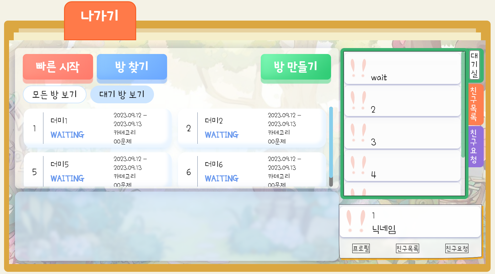
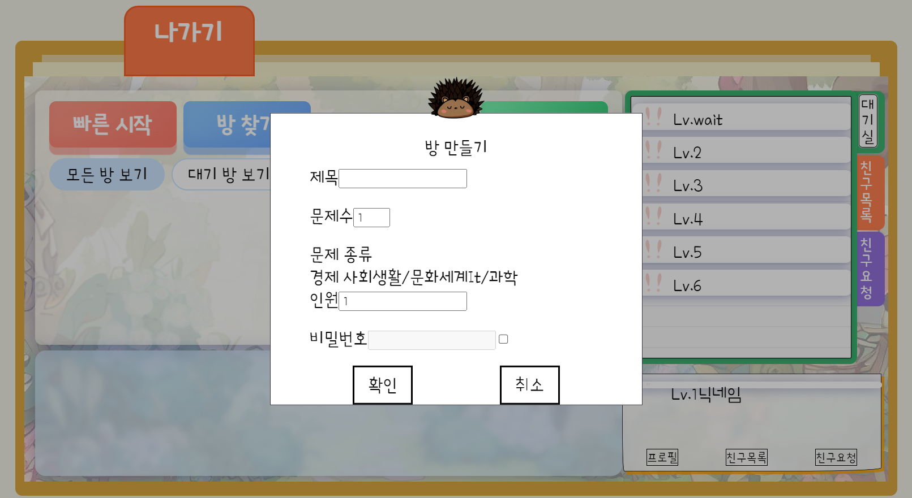
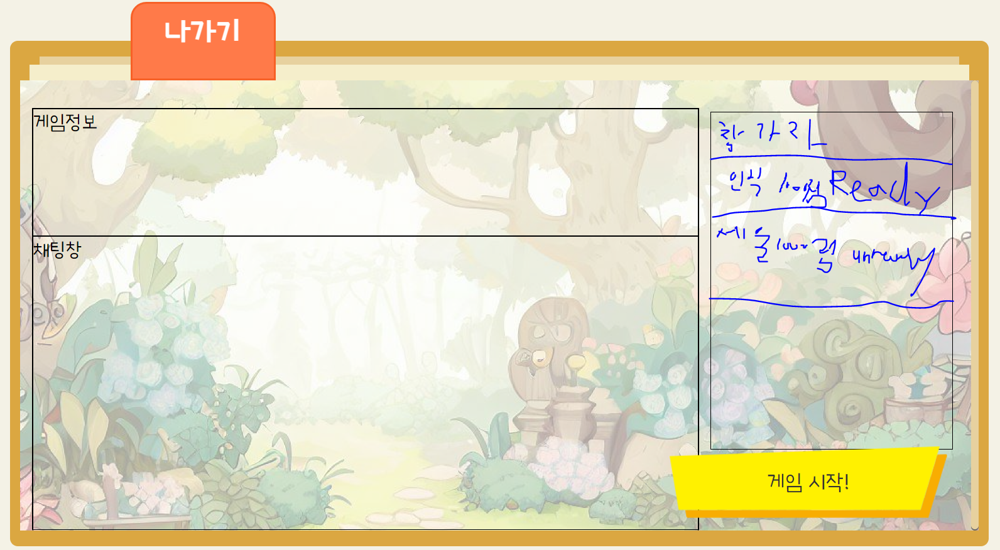

# Front를 위한 Socket 통신 매뉴얼

---

## 게임시작(to Lobby)

 

> ### 게임시작 눌렀을 때

- 로비 채팅
  
  - /pub/lobby/chat
    
    - 채팅전송
  
  - /sub/lobby/chat
    
    - 채팅수신

- 로비 방 목록
  
  - /pub/room/roomList
    
    - 로비로 들어왔다는 메세지 전송 필요
    
    - "enter": "enter to lobby"
  
  - /sub/room/roomList
    
    - 방 목록 정보 수신

- 로비 유저 목록
  
  - /pub/lobby/entrance(로비 입장)
    
    - 유저 정보
  
  - /pub/lobby/exit(로비 퇴장 -> 방 들어감 or 게임 나가기)
    
    - 유저 정보
  
  - /sub/lobby/list(로비에 있는 유저 목록 받아오기)
    
    - 유저 목록

 

 

 

 

 

 

 

 

--- 

## Room(게임 방 내)

 

 

 

 

> ### 방 만들기(확인 눌렀을 때)

- 방 만들기
  
  - /lobby(POST로 REST 요청을 해야 함)
    
    - 유저가 선택한 방 정보 전송
  
  - 미정
    
    - 방 정보 수신
  
  - /pub/room/entrance/{roomId}
    
    - 유저 정보 전송(방 참여 유저 리스트에 방만든 방장 정보 저장하는 용도)
  
  - /sub/room/member/{roomId}
    
    - 방에 입장한 유저 정보 수신(이 경우 방장만 뜸)

- 방 채팅
  
  - /pub/room/chat/{roomId}
    
    - 채팅 전송
  
  - /sub/room/chat/{roomId}
    
    - 채팅 수신

> ### 방 입장(방 선택해서 눌렀을 때)

- 방 입장
  
  - /pub/room/entrance/{roomId}
    
    - 유저 정보 전송
  
  - /sub/room/entrance/{roomId}
    
    - 방에 입장한 유저 정보 수신(방 참여 유저 리스트)
  
  - 미정
    
    - 방 정보 수신

 

 

- Ready
  
  - /pub/room/ready/{roomId}
    
    - 유저 정보 전송

- Unready
  
  - /pub/room/unready/{roomId}
    
    - 유저 정보 전송
